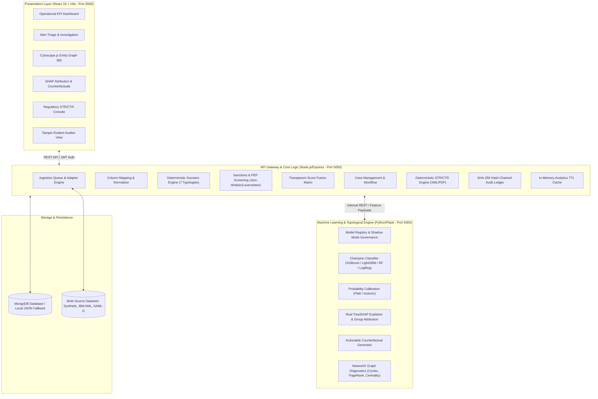
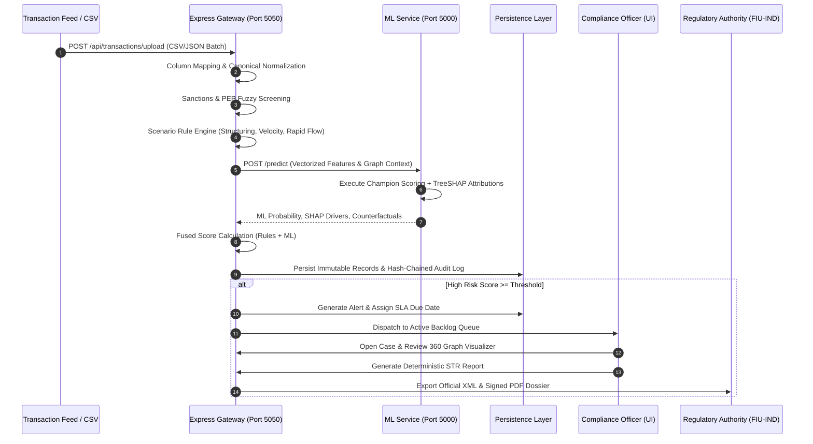

# FundTrace AI: Explainable AI & Topological Graph AML Monitoring Platform

[](https://github.com/ganeshsargar/FundTraceAI/actions)
[](https://opensource.org/licenses/MIT)
[](https://www.python.org/)
[](https://nodejs.org/)
[](https://react.dev/)

FundTrace AI is an enterprise-grade Anti-Money Laundering (AML) Transaction Monitoring, Explainable AI (XAI), and Topological Network Intelligence Platform. Engineered to solve the acute limitations of legacy, rule-only compliance systems (which suffer from 90%+ false-positive rates and opaque alert triage), FundTrace AI fuses deterministic regulatory scenario rules with calibrated machine learning classifiers, local TreeSHAP attribution, and NetworkX topological graph diagnostics.

---

## 🏛️ System Architecture



---

## 🔄 End-to-End Compliance Lifecycle



---

## ✨ Key Features & Research Contributions

### 1. Hybrid Score Fusion & Scenario Engine
- **Deterministic Regulatory Rules**: 7 configurable AML typologies (Structuring across accounts, rapid pass-through transit, round-amount smurfing, dormant account reactivation, cash intensity, high-risk jurisdiction routing, and many-to-one deposit aggregation).
- **Mathematical Score Fusion**: Fuses calibrated machine learning probabilities with deterministic rule hits into an auditable 0–100 composite risk score.

### 2. High-Fidelity Explainable AI (XAI)
- **Real SHAP Attribution**: Computes genuine Shapley additive feature importance values using TreeSHAP on tree ensembles (no fake heuristic values).
- **Correlated Feature Grouping**: Aggregates collinear features (e.g., amount, log_amount, is_large_amount) into business-meaningful risk domains (Amount & Structuring, Graph Topology, Velocity, Jurisdiction, Profile).
- **Actionable Counterfactuals**: Evaluates the minimal parameter shift (e.g., amount reduction, domestic clearing rails) required to lower a flagged transaction below the decision boundary.

### 3. Topological Graph Intelligence
- Directed multi-hop money flow graph modeling using NetworkX.
- Real-time cycle extraction (round-trip wash loops / layering schemes).
- PageRank centrality, in/out degree ratios, pass-through transit metrics, and shared-device / IP syndicate clustering.

### 4. Enterprise Compliance & Regulatory Integrity
- **Tamper-Evident Audit Chain**: Append-only audit log where every event block stores `SHA-256(sequence + previous_hash + timestamp + actor + action + details)`, verifiable via cryptographic chain audits.
- **Deterministic STR & CTR Drafting**: Automatically synthesizes FIU-IND compliant Suspicious Transaction Reports (STR) and Cash Transaction Reports (CTR) into structured XML and official PDF format without hallucinations.
- **Strict Data Immutability**: Enforces append-only transaction ledgers with explicit debit/credit adjustment entries.

---

## 🚀 Quickstart & Setup

### Prerequisites
- **Node.js**: v18.0.0 or higher
- **Python**: v3.10 or v3.11 with `pip`
- **MongoDB** (Optional): Defaults automatically to a built-in JSON file database if MongoDB is not running locally.

### 1. Automated One-Click Launch (Windows)
Double-click `run_all.bat` or run in terminal:
```cmd
run_all.bat
```
This automatically boots:
- Python ML Service on `http://localhost:5000`
- Express Gateway API on `http://localhost:5050`
- React Frontend Portal on `http://localhost:3000`

---

### 2. Manual Step-by-Step Installation

#### Step A: Python ML Engine Setup
```bash
# From workspace root
python -m venv .venv
# Windows:
.venv\Scripts\activate
# Linux/macOS:
# source .venv/bin/activate

pip install -r ml-service/requirements.txt
python ml-service/app.py
```

#### Step B: Express Gateway Backend Setup
```bash
cd backend
npm install
npm run dev
```

#### Step C: React Frontend Setup
```bash
cd frontend
npm install
npm run dev
```

---

## 📊 Dataset Options & Adapters

FundTrace AI supports flexible multi-source financial transaction datasets:

| Dataset | Description | Transactions | Default Location |
| :--- | :--- | :--- | :--- |
| **Synthetic Banking Feed** | Realistic multi-channel banking feed with 7 AML typologies | 10,000+ records | `dataset/dataset.csv` |
| **IBM AML / AMLSim** | Complex synthetic laundering networks with wash cycles | User-configurable | `dataset/adapters/ibm_aml_adapter.py` |
| **SAML-D Benchmark** | Multi-jurisdiction financial crime evaluation dataset | User-configurable | `dataset/adapters/saml_d_adapter.py` |
| **Custom CSV Imports** | Any banking CSV with dynamic fuzzy column auto-mapping | Arbitrary | Uploaded via UI |

To generate or regenerate the primary dataset:
```bash
python dataset/generate_dataset.py --rows 10000 --output dataset/dataset.csv
```

---

## 🧪 Running Automated Tests & Benchmark Suites

### Backend Unit, Controller & Integration Tests
```bash
cd backend
npm test
```
*Executes all 14 test suites covering Scenario Engine, Ingestion Queue, Fuzzy Screening, Regulatory STR Reporting, Immutability & Audit Hash Chain, Dashboard Analytics, and End-to-End Compliance Pipeline.*

### Python ML & XAI Test Suite (Pytest)
```bash
# Run all 40 pytest unit and integration tests
.venv\Scripts\pytest ml-service/tests -v
```

### End-to-End Compliance Integration Pipeline
```bash
cd backend
node --test test/e2eIntegration.test.js
```

### XAI Scientific Fidelity & Stability Evaluations
```bash
python ml-service/xai_eval/evaluate_xai.py
```
*Computes explanation fidelity (deletion/insertion curves), perturbation stability, and explanation complexity across champion model architectures.*

---

## 📈 Operational Dashboard & Research Analytics

The platform includes an enterprise operational analytics dashboard with server-side aggregation and in-memory TTL caching:
- **Operational Backlog & Velocity**: Real-time triage queues by status, 24h SLA urgency, on-time resolution percentage, and Mean Time to Close (MTTC).
- **Attribution & Detection Mode Breakdown**: Empirical comparative analysis of ML-only vs Rule-only vs Hybrid score fusion precision and STR conversion rates.
- **AML Typology Treemap**: Volume and critical alert distribution across structuring, layering, circular wash cycles, velocity bursts, and high-risk jurisdictions.
- **Geographic & Channel Risk Matrix**: 5x5 matrix evaluating risk intensity across payment rails (UPI, IMPS, RTGS, NEFT, CRYPTO) and amount brackets.
- **1-Click CSV Export**: Instant dataset download on every chart and leaderboard widget.

---

## ⚠️ Limitations & Future Work

1. **Synthetic vs. Production Domain Shift**:
   - Synthetic datasets (e.g. generated banking feeds, PaySim) simulate structured typologies well, but production bank environments feature unstructured merchant descriptors and irregular seasonality.
2. **Cold-Start in Dynamic Graph Topologies**:
   - Graph features (PageRank, cycle count, pass-through ratio) require sufficient historical transaction depth. Brand-new accounts lack graph edges until multiple counterparties interact.
3. **Cross-Border Regulatory Jurisdiction Nuances**:
   - Threshold parameters (e.g., CTR at ₹10,00,000 for FIU-IND vs $10,000 for FinCEN) require localized risk configuration across international deployments.
4. **Sub-Second Real-Time Streaming**:
   - While the Node.js scenario engine operates at sub-millisecond speeds, full KernelSHAP attribution on arbitrary non-tree neural networks introduces latency; TreeSHAP is optimized for tree ensembles.

---

## 📜 Research & Academic Reference

For full architectural derivations, mathematical formulations, feature equations, probability calibration curves, and ablation tables, see:
- [Methodology & Research Paper Reference](docs/METHODOLOGY.md)
- [REST API Specifications](docs/API.md)
- [Architecture Decision Records](docs/DECISIONS.md)

---

## 🎓 Academic Attribution & Authorship

- **Author**: Ganesh Sargar
- **Degree**: Master of Computer Applications (MCA)
- **Domain**: Explainable AI (XAI) in Financial Crime & Anti-Money Laundering (AML) Surveillance
- **Repository**: [ganeshsargar/xai-aml-monitoring-system](https://github.com/ganeshsargar/xai-aml-monitoring-system)

---

## 📄 License & Rights

**Copyright © 2026 Ganesh Sargar. All Rights Reserved.**

This software, methodology, mathematical formulations, and documentation are developed solely for **academic evaluation, university research, and educational demonstration** as part of the MCA degree curriculum. Commercial redistribution without prior authorization is strictly prohibited.

